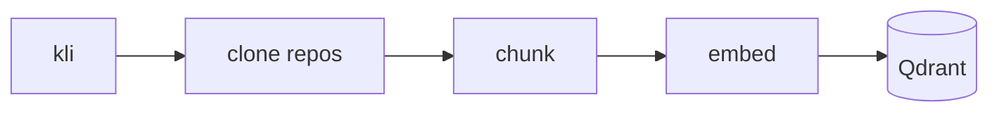
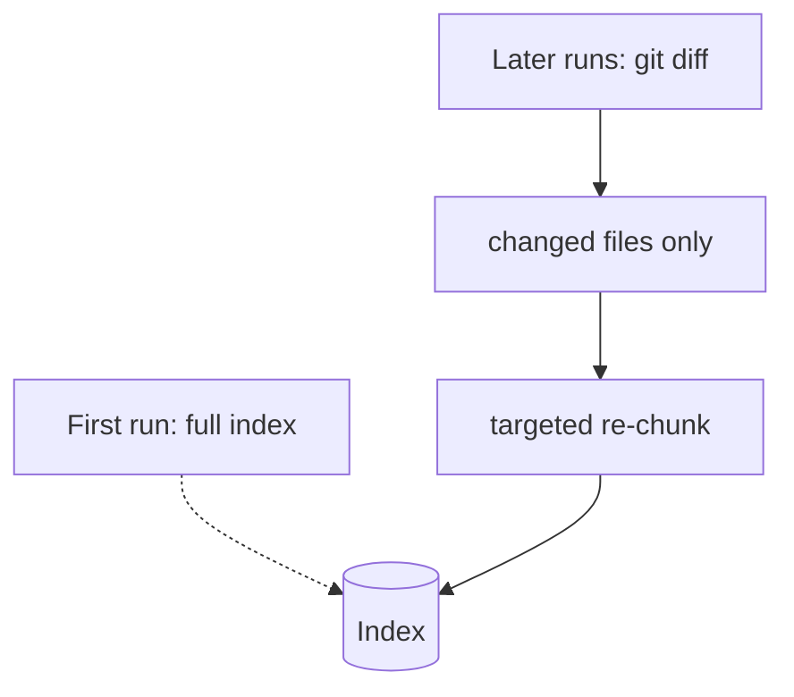

# Ingestion pipeline

How a Kalisio repository becomes indexed, queryable chunks.

## Pipeline stages

<!-- TODO: describe each stage — clone (kli), chunk (per file type), embed, store. -->

## Incremental ingestion

<!-- TODO: contrast the first full ingestion with subsequent diff-based runs. -->

## Configuration

<!-- TODO: env vars / config object fields that control ingestion (chunk size, sources…). -->

| Variable | Description | Default |
| --- | --- | --- |
| `…` | … | `…` |
