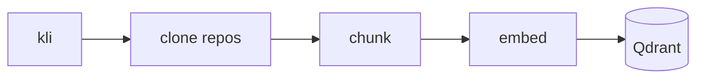
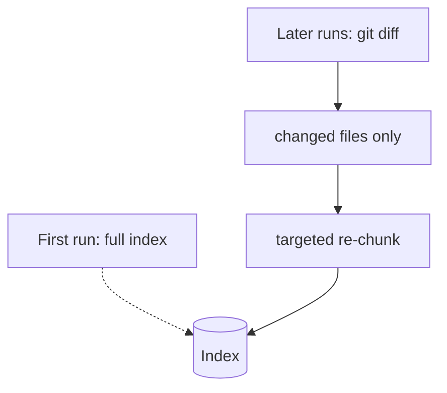

# Ingestion Job

The ingestion job is responsible for building and maintaining the three knowledge layers exposed by the API:

- **Code index**: indexes the Kalisio codebase into **Qdrant** to enable semantic code search.
- **Git index**: extracts Git history and engineering metrics (hotspots, co-changes, bus factor, etc.) into a **SQLite** database.
- **Dependency graph**: analyzes the codebase to build a graph of file dependencies and identify architectural relationships.

## Pipeline stages



<!-- TODO: describe each stage — clone (kli), chunk (per file type), embed, store. -->

## Incremental ingestion

<!-- TODO: contrast the first full ingestion with subsequent diff-based runs. -->



## Dependency graph

<!-- TODO -->


    # TODO incremental ingestion plan:
    #
    # 1. Clone / update repos via k-clone if needed:
    #    k-clone <organization> <workspace|all>
    #
    # 2. Recover the last successful ingestion timestamp
    #
    # Store it in a dedicated metadata collection, separate from the code
    # collection, with a single record such as:
    #   {
    #     "id": "collection_metadata",
    #     "payload": {"last_ingestion": "2026-06-19T10:35:00Z"}
    #   }
    #
    # Dates should be stored and read in ISO 8601 format. Read this value at
    # the beginning of each run. On the first ingestion, the metadata record
    # does not exist yet.
    #
    # 3. Build the candidate file list
    #
    # first_ingestion ?
    # ├─ Yes:
    # │    Scan every supported file in the selected repositories.
    # │
    # └─ No:
    #      Use last_ingestion only as a recovery cursor to identify files that
    #      may have changed since the previous successful run.
    #      Example candidate source:
    #          git log --since=<last_ingestion_iso8601> --name-only
    #                  --pretty=format:
    #
    # Result:
    #   candidate_files = files that may need reindexation
    #
    # 4. Confirm actual content changes with file_sha1
    #
    # For each candidate file:
    #   - Read the current file content.
    #   - Compute file_sha1 from the file content itself.
    #   - Compare it with the file_sha1 already stored in Qdrant for the same
    #     (repo, path).
    #   - If the hash is unchanged, skip the file.
    #   - If the hash changed, mark the file for reindexation.
    #
    # The final reindexation decision should rely on file_sha1, not on git log:
    # git history is useful to reduce the scan perimeter and to enrich
    # commit_history, but the hash is the reliable state-based check.
    #
    # 5. Synchronize the vector store
    #
    # For each file marked for reindexation:
    #   - Delete the existing chunks for (repo, path) to avoid
    #     stale versions remaining in the collection.
    #   - Re-chunk the current file content.
    #   - Recompute embeddings.
    #   - Upsert the new chunks and metadata into the code collection.
    #
    # 6. Persist ingestion metadata
    #
    # Only after a successful run, update the metadata collection with the new
    # last_ingestion timestamp. Do not update it at job start, otherwise a
    # failed run could move the recovery cursor forward and miss files.

## Workspace layout

The job scans `DEVELOPMENT_DIR`, the directory `k-clone` works from. It holds
one directory per organisation, and each of those holds the cloned
repositories:

```
$DEVELOPMENT_DIR/
├── kalisio/      kdk, kano, development, kli, …
├── irsn/         planet, criter, …
└── airbus/       Gift-*, …
```

So a repository sits two levels down, and that is what the scan looks for (a
repository sitting directly under the root is picked up too, which is how a
hand-made workspace is laid out). A file is identified by the repository
holding it and its path inside that repository — never by its path from the
workspace, so `repo` stays `kano` and not `kalisio/kano`.

## Commit history

The commit history of a file is stored **once per file**, in its own
collection (`QDRANT_COLLECTION_FILES`, derived from the code collection by
default), and joined back onto every chunk of that file when a search
returns it. Storing it on each chunk instead multiplies it by the number of
chunks — eight times more on the kdk corpus.

What is kept is a sliding window: commits older than
`COMMIT_HISTORY_MAX_AGE_DAYS` (180) drop off on their own and new ones come
in, with a floor of `COMMIT_HISTORY_MIN_COMMITS` (5) kept whatever their age
— without it, 84% of the kdk files would carry no history at all, and those
are the stable files whose intent is hardest to recover from the code.
`COMMIT_HISTORY_DEPTH` (0, no cap) can bound a very active file.

The window is rebuilt from git on every run, for every scanned file and not
only the ones being reindexed, so a file nobody touched still lets its
oldest commits go. It costs one `git log` pass per repository — 2.4 s over
the 70 repositories of the workspace, against about four minutes if git were
asked per file.
