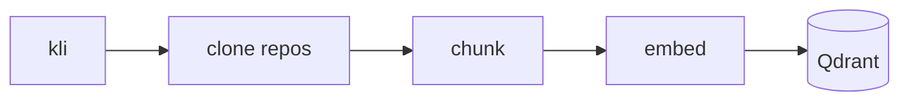
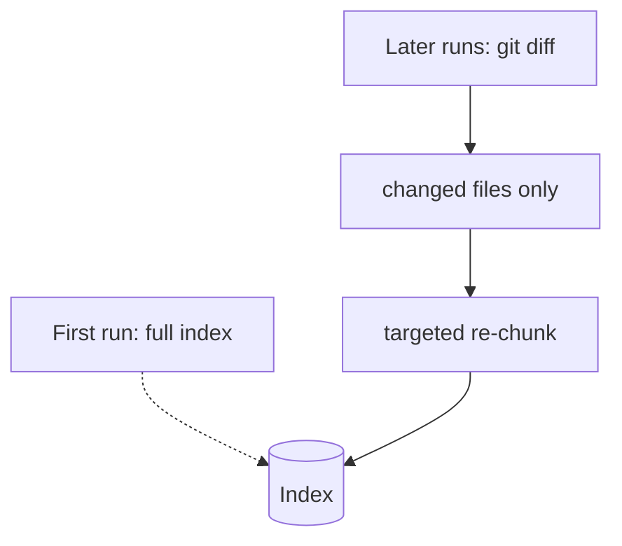

# Ingestion Job

The ingestion job is responsible for building and maintaining the three knowledge layers exposed by the API:

- **Code index**: indexes the Kalisio codebase into **Qdrant** to enable semantic code search.
- **Git index**: extracts Git history and engineering metrics (hotspots, co-changes, bus factor, etc.) into a **SQLite** database.
- **Dependency graph**: analyzes the codebase to build a graph of file dependencies and identify architectural relationships.

## Pipeline stages

<!-- TODO: describe each stage — clone (kli), chunk (per file type), embed, store. -->

## Incremental ingestion

<!-- TODO: contrast the first full ingestion with subsequent diff-based runs. -->

## Configuration

<!-- TODO: env vars / config object fields that control ingestion (chunk size, sources…). -->

| Variable | Description | Default |
| --- | --- | --- |
| `…` | … | `…` |
