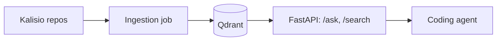

# Architecture overview

<!-- TODO: one paragraph framing the whole system, then the global diagram. -->

## Global architecture

<!-- TODO: how the pieces run together — CI, dev machine, Kubernetes. -->

## How the system fits together

This section is split per concern:

- [Ingestion pipeline](/architecture/ingestion-pipeline) — how repos become indexed chunks.
- [RAG: indexing & retrieval](/architecture/rag) — how a question becomes relevant chunks.
- [API endpoints](/architecture/api) — the HTTP surface (`/ask`, `/search`, `/health`).
