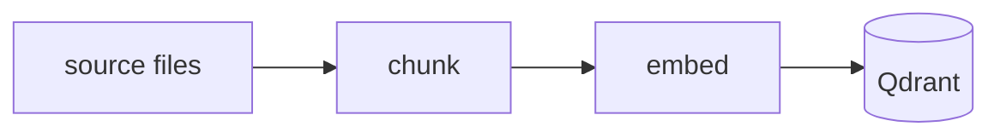
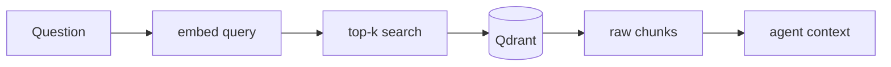

# RAG: indexing & retrieval

## Indexing

<!-- TODO: chunk → embed → store in Qdrant. Cross-link to the ingestion pipeline. -->

## Retrieval

<!-- TODO: question → embed → top-k search → raw chunks back to the agent. -->

## Why RAG: with vs without

| Approach | What the agent reads | Input tokens (approx.) |
| --- | --- | --- |
| Without RAG | ~30 files | ~40k |
| With RAG | 1 `/search` call → ~5 chunks | ~8k |

::: tip
See [Research](/research/introduction) for the experiments behind these figures.
:::
